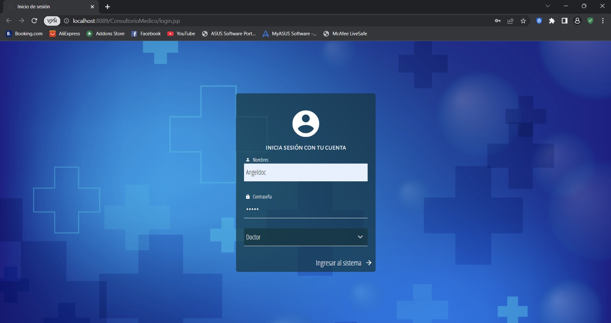
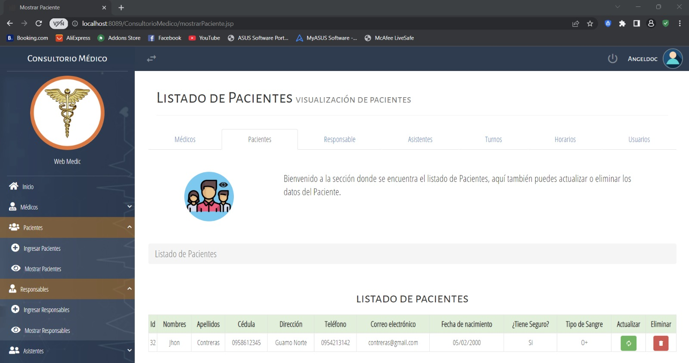

# 🩺 Gestión de Consultorio Médico

Este es un sistema basado en la web para la gestión integral de un consultorio médico, que permite administrar la información de pacientes, médicos, turnos y personal administrativo.

## 🚀 Inicio Rápido

### Requisitos previos:
- **Java 17 o superior**
- **Maven**
- **Base de Datos:** Oracle / MySQL (Soporte JPA)
- **Servidor:** Apache Tomcat 9/10

### Instalación:
1. Clonar el repositorio.
2. Configurar la base de datos en `src/main/resources/META-INF/persistence.xml`.
3. Ejecutar `mvn clean install` para construir el proyecto.
4. Desplegar el archivo `.war` en el servidor Tomcat.

---

## 🏛️ Documentación de Arquitectura

Para un análisis técnico sobre las capas del sistema, consulte el documento:
👉 **[Documentación de Arquitectura](./docs/ARCHITECTURE.md)**

---

## 📸 Galería de Módulos

A continuación, se detallan las funcionalidades principales del sistema con su respectiva interfaz visual.

### 1. Acceso al Sistema (Login)
Este módulo es la puerta de entrada, garantizando que solo el personal autorizado acceda a la gestión de datos sensibles.
- **Componentes:** Autenticación por Email/DNI y contraseña.
- **Backend:** Gestionado por `SrvLogin.java` y sesiones HTTP.

### 2. Panel Principal (Dashboard)
Centro neurálgico del sistema con vista panorámica del consultorio.
- **Funcionalidad:** Navegación centralizada y acceso rápido a todos los módulos.
- **Diseño:** Basado en **SB Admin 2** (Bootstrap 4).

### 3. Gestión de Médicos (Registro)
Permite dar de alta a nuevos profesionales de la salud.
- **Campos:** Datos personales, legajo, especialidad y horarios.
- **Persistencia:** Guardado mediante JPA a través del servlet `SvrDoctores.java`.

### 4. Administración de Pacientes (Listado)
Visualización dinámica de todos los registros de pacientes atendidos.
- **Acciones:** Búsqueda, edición (`actualizarPaciente.jsp`) y eliminación lógica.
- **Visualización:** Tabla dinámica generada con JSP.

### 5. Registro de Pacientes (Alta)
Interfaz dedicada al ingreso de información de pacientes y sus responsables.
- **Flujo:** Registro de datos básicos y vinculación con obra social.
- **Tecnología:** Persistencia automática de la relación Paciente-Responsable.

---

## ✨ Características Técnicas

- **Arquitectura en 3 Capas:** Separación de Presentación (JSP), Lógica (Servlets) y Persistencia (JPA).
- **Interfaz Responsiva:** Compatible con dispositivos móviles.
- **Seguridad:** Gestión de sesiones y protección de rutas.

---

Desarrollado para mejorar la eficiencia operativa en consultorios médicos.
