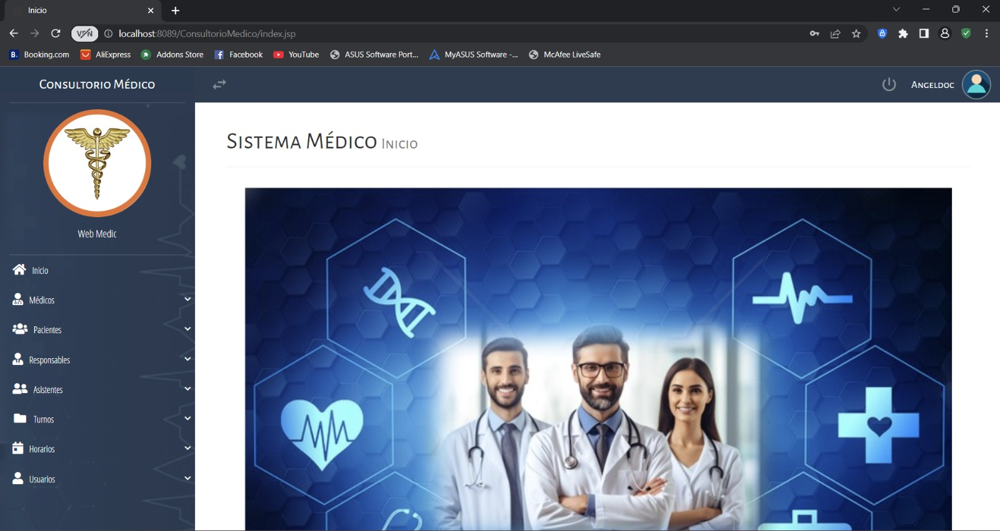

# 📊 Panel Principal (Dashboard)

El Panel Principal o Dashboard es el centro neurálgico del sistema, ofreciendo una vista panorámica del estado actual del consultorio.

## 📸 Interfaz del Panel Principal

## 🛠️ Detalles de Implementación

- **Componentes Visuales:**
  - Barra lateral de navegación con acceso a todos los módulos.
  - Tarjetas informativas de acceso rápido.
  - Menú de usuario en la parte superior derecha.
- **Funcionalidad:**
  - Centraliza la navegación del sistema.
  - Permite visualizar estadísticas rápidas (si están implementadas).
- **Diseño:** Basado en el framework **SB Admin 2**, asegurando una experiencia de usuario (UX) fluida y adaptiva.
