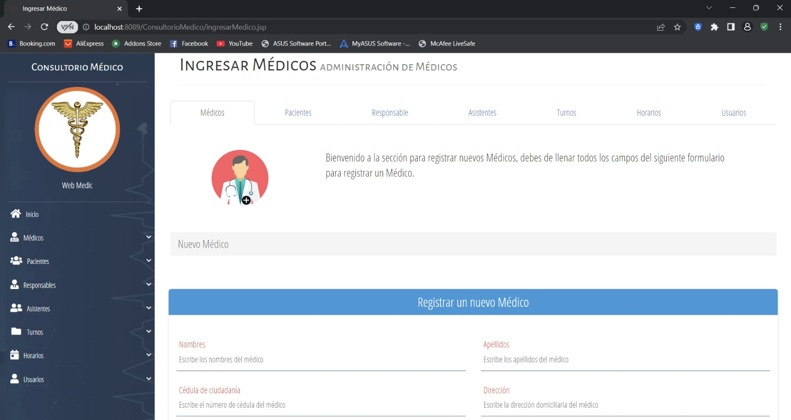

# 🩺 Registro de Médicos

Este módulo permite dar de alta a nuevos profesionales de la salud en la plataforma.

## 📸 Formulario de Registro

## 🛠️ Detalles de Implementación

- **Campos del Formulario:**
  - Datos Personales: Nombre, Apellido, DNI, Teléfono.
  - Datos Profesionales: Legajo, Especialidad, Horarios Asignados.
- **Backend:**
  - Servlet encargado: `SvrDoctores.java`.
  - Acción: `POST` para creación y guardado en la base de datos a través de JPA.
- **Validaciones:**
  - Campos obligatorios (DNI, Especialidad).
  - Evitar duplicidad de legajos.
