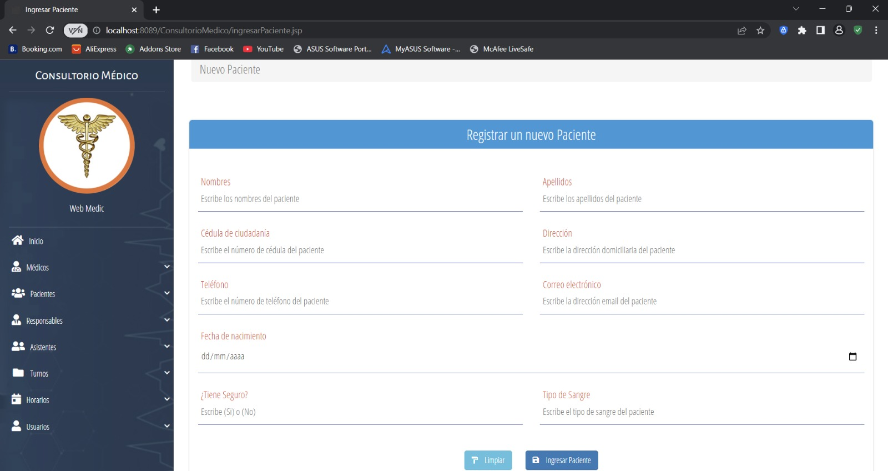

# ➕ Alta de Nuevos Pacientes

Interfaz dedicada al ingreso de información de nuevos pacientes y sus responsables (en caso de ser menores).

## 📸 Formulario de Alta

## 🛠️ Detalles de Implementación

- **Flujo de Trabajo:**
  1. Ingreso de datos básicos del paciente.
  2. Vínculo con un Responsable (opcional o requerido según edad).
  3. Registro de Obra Social.
- **Backend:**
  - Proceso asíncrono o síncrono mediante `SvrPacientes.java`.
  - Persistencia automática de la relación `Paciente-Responsable`.
- **Diseño del Formulario:** Implementado con clases de Bootstrap para asegurar la correcta visualización en cualquier resolución.
